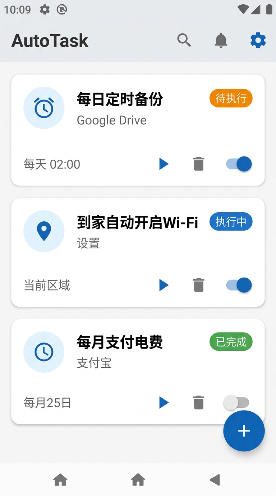
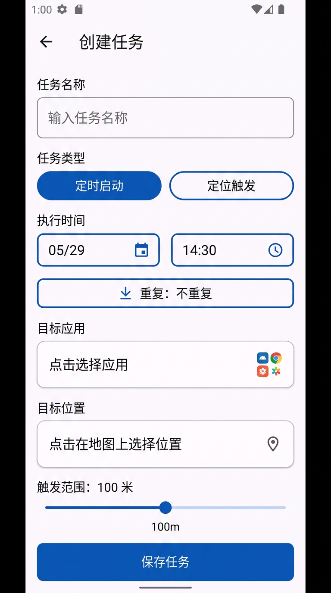
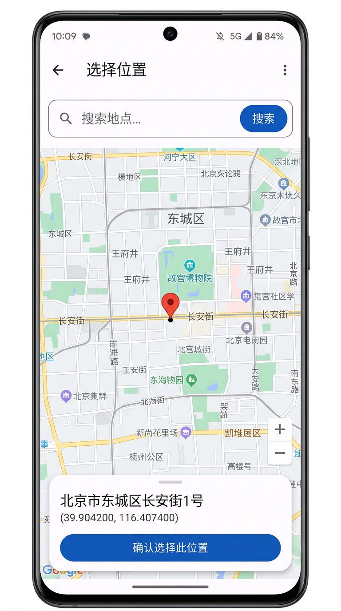
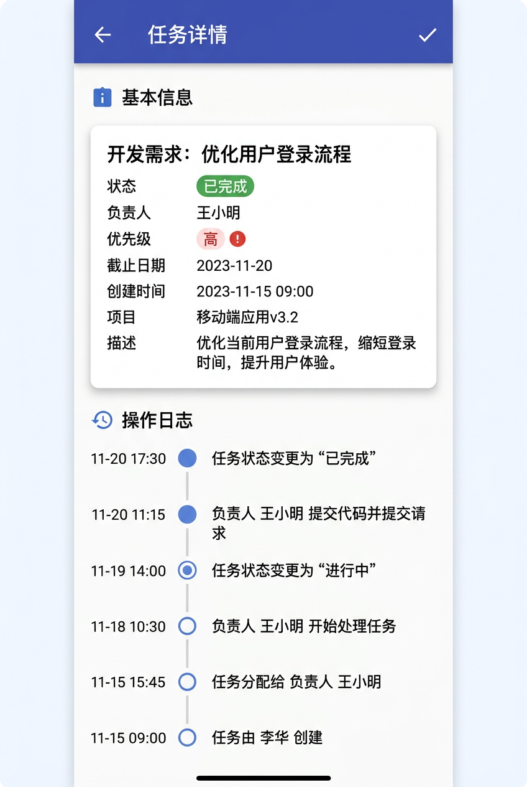

# AutoTask - Android 自动任务工具

一款基于 Android 平台的自动任务工具，支持 **定时启动 App** 和 **定位触发任务** 两大核心功能。采用 Kotlin + Jetpack Compose + Material 3 构建，使用高德地图 SDK 提供国内可用的地图与定位服务。

## 功能特性

- **定时启动 App** - 设定时间自动打开指定应用，支持不重复 / 每天 / 每周循环
- **定位触发任务** - 在指定时间开启高精度定位，当设备到达目标位置（误差 ≤100m）时自动启动 App
- **地图选点** - 基于高德地图 3D SDK，支持搜索 POI、点击地图选点、逆地理编码
- **任务通知** - 任务完成后在通知栏展示执行结果和使用的权限
- **任务历史** - 每个任务的执行日志以 Timeline 形式展示，方便排查问题
- **开机恢复** - 设备重启后自动恢复所有待执行任务的调度
- **权限管理** - 内置权限管理页面，引导用户授予必要权限

## 技术栈

| 类别 | 技术 |
|------|------|
| 语言 | Kotlin 1.9.22 |
| UI 框架 | Jetpack Compose + Material 3 |
| 架构 | MVVM + Repository (手动 DI) |
| 数据库 | Room 2.6.1 (KSP) |
| 地图 | 高德地图 3D SDK 9.8.3 |
| 定位 | 高德定位 SDK 6.4.3 |
| 搜索 | 高德搜索 SDK 9.7.2 |
| 调度 | AlarmManager `setExactAndAllowWhileIdle` |
| 后台服务 | Foreground Service (location type) |
| 构建 | AGP 8.2.2 + Gradle 8.5 |

## 项目结构

```
TaskScheduler/
├── build.gradle.kts              # 根构建脚本 (AGP, Kotlin, KSP)
├── settings.gradle.kts           # 项目设置 (含高德 Maven 仓库)
├── gradle.properties
├── gradle/wrapper/
│   └── gradle-wrapper.properties # Gradle 8.5
└── app/
    ├── build.gradle.kts          # 应用构建脚本 + 依赖
    ├── proguard-rules.pro        # 混淆规则 (高德, Room, Coroutines)
    └── src/main/
        ├── AndroidManifest.xml   # 权限声明 + 组件注册
        ├── java/com/tim/autotask/
        │   ├── AutoTaskApp.kt              # Application: Room/Repository/通知渠道初始化
        │   ├── MainActivity.kt             # 入口 Activity: 权限请求 + Compose 入口
        │   ├── data/
        │   │   ├── model/
        │   │   │   ├── Task.kt             # Room Entity: 任务表
        │   │   │   ├── TaskLog.kt          # Room Entity: 日志表 (FK→Task)
        │   │   │   ├── TaskType.kt         # 枚举: SCHEDULED_LAUNCH / LOCATION_TRIGGERED
        │   │   │   ├── TaskStatus.kt       # 枚举: PENDING / EXECUTING / COMPLETED / FAILED
        │   │   │   └── RepeatType.kt       # 枚举: NONE / DAILY / WEEKLY
        │   │   ├── db/
        │   │   │   ├── AppDatabase.kt      # Room Database 定义
        │   │   │   ├── Converters.kt       # 枚举 TypeConverter
        │   │   │   ├── TaskDao.kt          # 任务 CRUD + Flow 观察
        │   │   │   └── TaskLogDao.kt       # 日志 CRUD + Flow 观察
        │   │   └── repository/
        │   │       └── TaskRepository.kt   # 数据仓库: 封装 DAO + addLog
        │   ├── scheduler/
        │   │   ├── TaskScheduler.kt        # AlarmManager 调度: 精确闹钟 + 重复任务
        │   │   ├── AlarmReceiver.kt        # 闹钟触发: WakeLock + 启动App/定位服务
        │   │   └── BootReceiver.kt         # 开机恢复: 重新调度所有活跃任务
        │   ├── service/
        │   │   └── LocationMonitorService.kt  # 前台服务: 高德定位 + 距离判定 + 触发
        │   ├── notification/
        │   │   └── NotificationHelper.kt   # 通知: 任务完成通知 + 前台服务通知
        │   ├── ui/
        │   │   ├── theme/
        │   │   │   ├── Color.kt            # Material 3 色彩 + 任务状态色
        │   │   │   ├── Theme.kt            # 主题: 动态取色支持
        │   │   │   └── Type.kt             # 排版定义
        │   │   ├── components/
        │   │   │   ├── TimelineView.kt     # 时间线组件: 彩色圆点 + 连线 + 日志
        │   │   │   └── AppPickerDialog.kt  # 应用选择器: 搜索 + 列表
        │   │   ├── navigation/
        │   │   │   └── AppNavigation.kt    # Compose Navigation: 路由 + 参数传递
        │   │   └── screens/
        │   │       ├── HomeScreen.kt       # 首页: 任务列表 + 状态卡片
        │   │       ├── HomeViewModel.kt    # 首页 VM: Flow + 调度操作
        │   │       ├── CreateTaskScreen.kt # 创建任务: 表单 + 日期时间选择器
        │   │       ├── CreateTaskViewModel.kt
        │   │       ├── MapPickerScreen.kt  # 地图选点: AMap 3D + POI搜索 + 逆地理编码
        │   │       ├── MapPickerResult.kt  # 选点结果数据类
        │   │       ├── TaskDetailScreen.kt # 任务详情: 信息卡 + Timeline 日志
        │   │       ├── TaskDetailViewModel.kt
        │   │       └── SettingsScreen.kt   # 设置: 权限管理 + 厂商限制提示
        │   └── util/
        │       └── PermissionHelper.kt     # 权限检查工具
        └── res/                            # 资源文件 (图标, 字符串, 主题)
```

## 关键实现

### 1. 精确定时调度

使用 `AlarmManager.setExactAndAllowWhileIdle()` 确保在 Doze 模式下仍能准时触发。支持三种重复模式：

```
不重复 → 一次性调度
每天   → 触发后计算下次时间 (当前时间 + 24h 循环)
每周   → 触发后计算下次时间 (当前时间 + 7天 循环)
```

闹钟触发时通过 `BroadcastReceiver` + `WakeLock` (30s) 保证 CPU 不休眠，异步完成后释放。

### 2. 定位触发任务

采用 **前台服务 + 高德定位 SDK** 方案：

1. 闹钟触发后启动 `LocationMonitorService` (Foreground Service)
2. 使用 `Hight_Accuracy` 模式，5 秒间隔持续定位
3. 通过 Android `Location.distanceTo()` 计算与目标点的距离
4. 距离 ≤ `locationRadius` (默认 100m) 时触发操作，启动目标 App
5. 完成后发送通知、记录日志、停止定位服务

### 3. 任务执行日志 (Timeline)

每个任务关联独立的日志表 (`task_logs`)，通过外键 `CASCADE` 与任务表关联。日志分四级：

| 级别 | 颜色 | 用途 |
|------|------|------|
| INFO | 蓝色 | 常规流程记录 |
| SUCCESS | 绿色 | 操作成功确认 |
| WARNING | 橙色 | 定位错误等非致命问题 |
| ERROR | 红色 | 应用启动失败等致命错误 |

### 4. 地图选点

通过 `AndroidView` 嵌入高德 3D MapView，支持：

- **默认定位**: 启动时获取当前位置并移动相机
- **POI 搜索**: 输入关键词，调用 `PoiSearch` API 搜索并定位
- **点击选点**: 点击地图任意位置，放置红色 Marker
- **逆地理编码**: 选点后调用 `GeocodeSearch` 获取中文地址

### 5. 开机任务恢复

`BootReceiver` 监听 `ACTION_BOOT_COMPLETED`，启动后从数据库读取所有 `PENDING` / `EXECUTING` 状态的任务，逐一重新调度到 `AlarmManager`。

## 页面截图

| 首页 - 任务列表 | 创建任务 |
|:---:|:---:|
|  |  |

| 地图选点 | 任务详情 & 执行日志 |
|:---:|:---:|
|  |  |

## 使用前准备清单

### 必须完成

- [ ] **申请高德地图 API Key**
  - 前往 [高德开放平台](https://lbs.amap.com/) 注册账号
  - 创建 Android 应用，获取 SHA1 指纹和包名 `com.tim.autotask`
  - 申请 Key 后替换 `app/build.gradle.kts` 中的占位符：
    ```kotlin
    manifestPlaceholders["AMAP_KEY"] = "YOUR_AMAP_API_KEY"  // ← 替换为你的 Key
    ```

- [ ] **配置 Gradle 环境**
  - 确保已安装 Android Studio Hedgehog (2023.1.1) 或更新版本
  - JDK 17（Android Studio 自带）
  - 首次打开项目等待 Gradle Sync 完成

### 权限说明

应用运行需要以下权限，启动时会自动请求部分权限，其余需在设置页手动授予：

| 权限 | 用途 | 请求方式 |
|------|------|----------|
| 精确定位 | 定位触发任务 | 启动时自动弹窗 |
| 后台定位 (Android 10+) | 持续监听位置 | 设置页手动跳转 |
| 通知权限 (Android 13+) | 任务完成通知 | 启动时自动弹窗 |
| 精确闹钟 | 定时触发任务 | 设置页手动跳转 |
| 悬浮窗 | 后台启动 App | 设置页手动跳转 |
| 关闭电池优化 | 保证任务可靠执行 | 设置页手动跳转 |
| 开机自启 | 重启后恢复任务 | 自动注册 |

### 厂商适配注意

国产 Android 手机（小米、华为、OPPO、vivo 等）可能有额外的后台限制，建议：

1. 将 AutoTask 设为 **自启动** 应用
2. 在最近任务中 **锁定** AutoTask
3. 关闭 AutoTask 的 **省电策略** / **后台限制**
4. 部分厂商需要额外开启 "允许后台活动" 选项

## 构建 & 安装

```bash
# Debug 构建
./gradlew assembleDebug

# Release 构建 (需配置签名)
./gradlew assembleRelease
```

APK 输出路径: `app/build/outputs/apk/`

## 许可证

本项目仅供学习参考。
